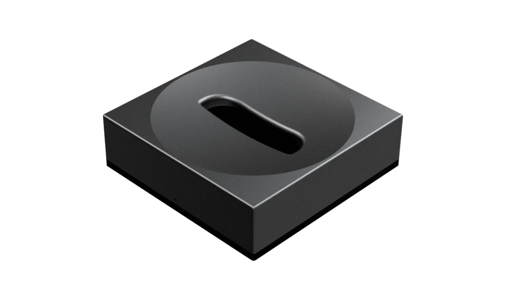
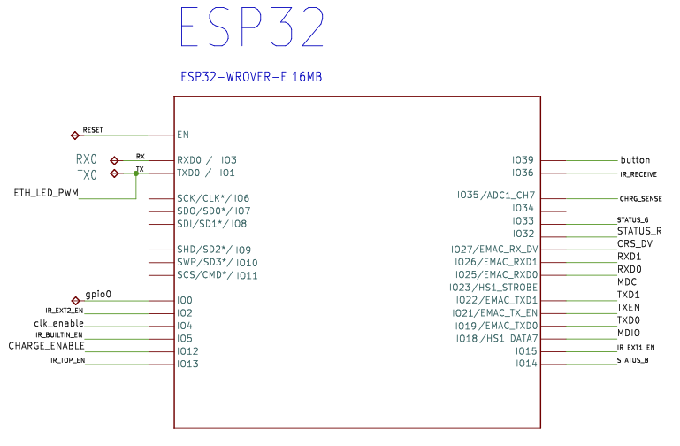

# Unfolded Circle Dock Two Firmware

[](LICENSE)

This repository contains the firmware of the Unfolded Circle Smart Charging Dock (UCD2), which is shipped with the [Unfolded Circle Remote Two](https://www.unfoldedcircle.com/remote-two).



The dock features an Espressif ESP32-WROVER-E MCU module with WiFi and Ethernet connectivity, internal infrared blasters and learning, and supports two external IR extenders.

The dock can be controlled with the [WebSocket Dock API](https://github.com/unfoldedcircle/core-api/tree/main/dock-api).

## Developer Setup

- [Visual Studio Code](https://code.visualstudio.com/)
- [PlatformIO IDE extension](https://marketplace.visualstudio.com/items?itemName=platformio.platformio-ide)
- [cpplint](https://github.com/cpplint/cpplint)

## Build

- Production unit hardware revision build flag: `HW_REVISION=5.4`
  - The sources also contain the older revisions, but the build entries have been removed.
- Build configurations:
  - `UCD2-r5_4-dev`: local development build, creating an unsigned firmware, only suitable for UART flashing.
  - `UCD2-r5_4-GitHub`: CI build, creating a signed production firmware for version tags.

Command line:

```shell
pio run -e UCD2-r5_4-dev
```

Visual Studio:

1. Switch to PlatformIO view
2. Projects tasks, `UCD2-r5_4-dev`, General: Build

## Update Firmware

‼️ Attention:
- An unsigned development firmware cannot be flashed on a production unit with OTA!
- A production firmware can only be replaced with a development firmware with UART flashing!
- UART flashing requires to open the dock to access the UART pins.
- The USB-C port does not provide UART functionality.
- Warranty is void if the dock is opened and a custom firmware is flashed with UART!

### Upload with UART

The UART uses 3.3V levels for RX and TX.

1. To upload a firmware with UART, the ESP has to be put in flash mode first.
2. Set the serial adapter device in `platform.ini`: `upload_port` & `monitor_port`.
3. Then use the PIO `Upload` or `Upload and Monitor` command in the PlatformIO view.

Alternatively, the `esptool` command line tool can be used:

```shell
esptool.py --chip esp32 --port "$SERIAL_DEV" --baud 460800 \
  --before default_reset --after hard_reset write_flash \
  -z --flash_mode dio --flash_freq 40m --flash_size detect \
  0x1000 bootloader.bin \
  0x8000 partitions.bin \
  0x10000 firmware.bin
```

### OTA with POST request

⚠️  Unsigned development firmware (only works if existing firmware is also unsigned!)
```shell
curl  -F "file=@.pio/build/$UCD2_MODEL/firmware.bin" http://${DOCK_IP}/update
```

Signed production firmware (only works if existing firmware was signed with the same x509 private key):
```shell
curl  -F "file=@.pio/build/$UCD2_MODEL/firmware.bin.signed" http://${DOCK_IP}/update
```

To use a signed development firmware, you have to create your own x509 private and public keys, replace the `ota_public_key*.pem` file(s) and either sign the firmware binary manually with [sign_firmware.py](sign_firmware.py) or change the build configuration in `platformio.ini` and GitHub build action. The concept is described in [doc/ota-signing.md](doc/ota-signing.md) and `UCD2-r5_4-GitHub` build target can be used as reference. 

## Pinout



The pins are defined in the [`lib/config/board_5_4.h`](lib/config/board_5_4.h) header file (using `HW_REVISION=5.4` build flag).

## Recent changes

The major changes found in each new release are listed in the [CHANGELOG](./CHANGELOG.md) and
under the GitHub [releases](https://github.com/unfoldedcircle/ucd2-firmware/releases).

## Contributions

Please read our [contribution guidelines](./CONTRIBUTING.md) before opening a pull request.

## License

This project is licensed under the [**GNU General Public License v2.0 or later**](https://www.gnu.org/licenses/old-licenses/gpl-2.0.en.html).
See the [LICENSE](LICENSE) file for details.
